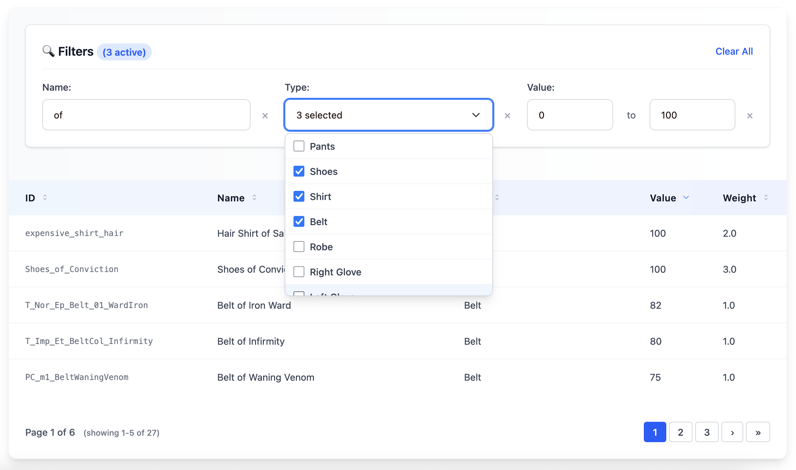
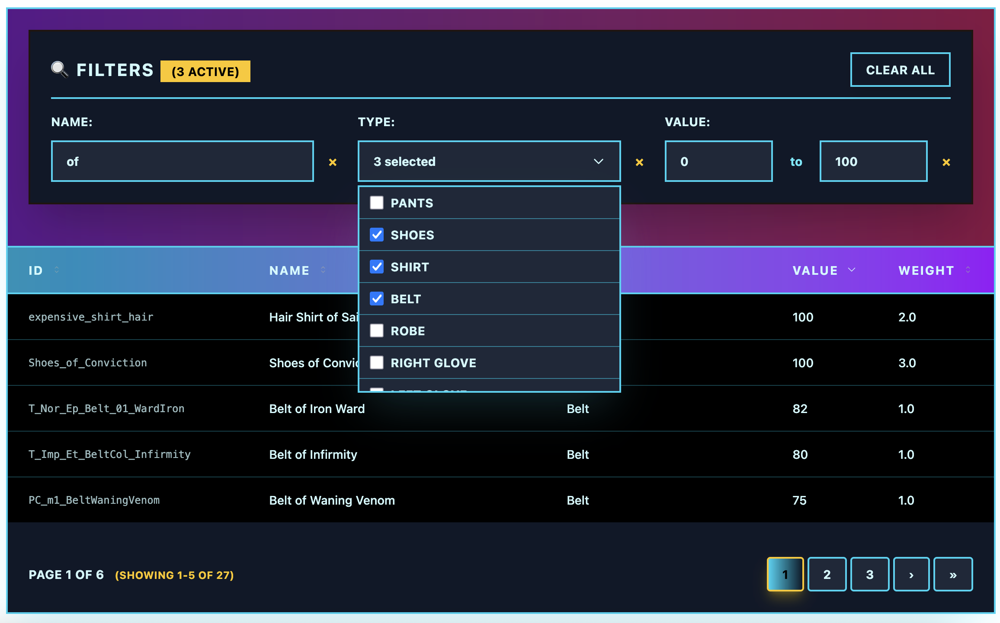
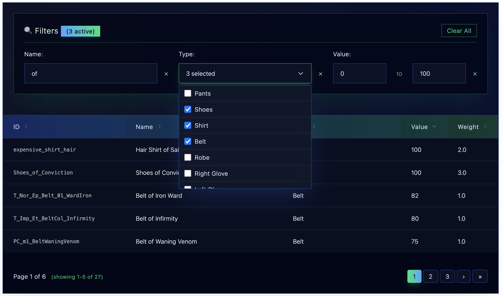
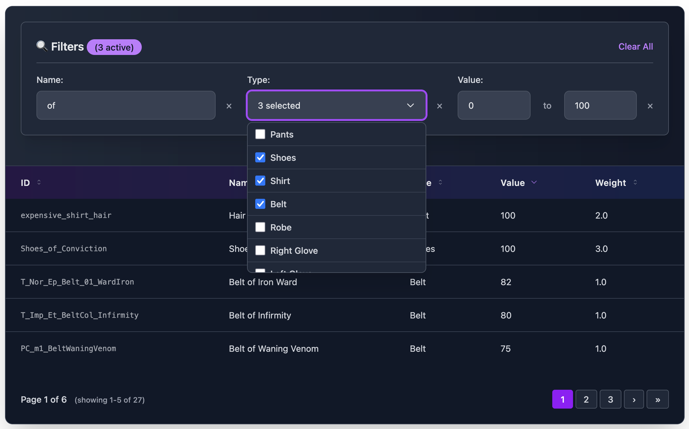
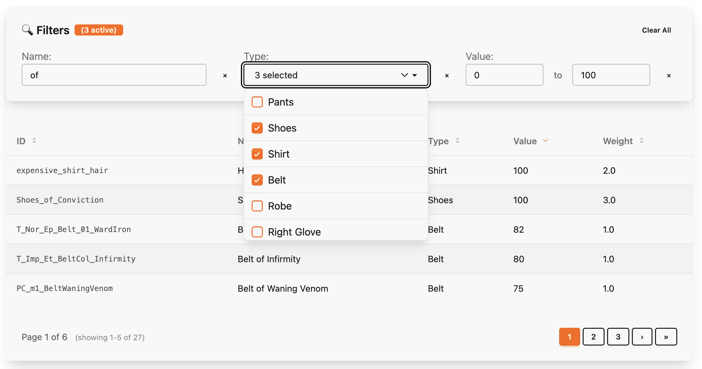
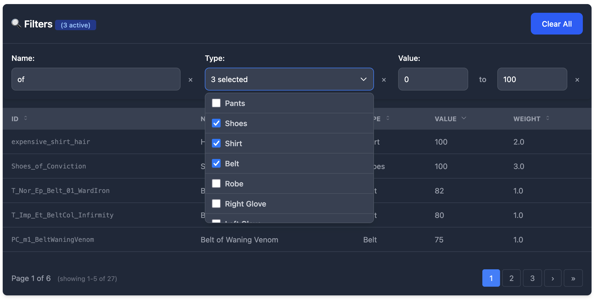
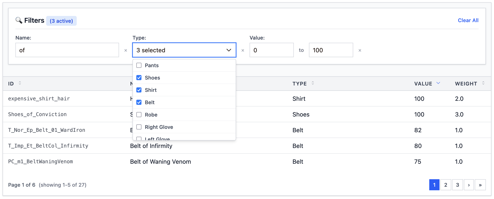

# Theme Showcase

This document showcases the dramatic visual variety possible with Cinder's theming system. Each theme completely transforms the appearance while maintaining full functionality.

> **Getting Started**: For technical documentation on creating and customizing themes, see the [Theming Guide](theming.md).

## Default Theme (Minimal)

The default theme provides only essential usability classes - no styling, perfect for integration with any CSS framework.

```elixir
# No theme specified = minimal default
<Cinder.collection
  resource={User}
  actor={@current_user}
>
  <:col field="name" />
  <:col field="email" />
  <:col field="role" />
</Cinder.collection>
```

**Classes applied**: Only `overflow-x-auto`, `w-full border-collapse`, `text-left whitespace-nowrap`

## Modern Theme

Professional, clean design with subtle shadows and blue accents.

```elixir
<Cinder.collection
  resource={User}
  actor={@current_user}
  theme="modern"
>
  <:col field="name" />
  <:col field="email" />
  <:col field="role" />
</Cinder.collection>
```

**Visual Features**:
- White background with rounded corners and subtle shadows
- Blue gradient headers with professional typography
- Smooth hover transitions
- Modern form inputs with focus states
- Clean pagination with border styling



## Retro Theme

Bold 80s-inspired design with neon colors and cyberpunk aesthetics.

```elixir
<Cinder.collection
  resource={User}
  actor={@current_user}
  theme="retro"
>
  <:col field="name" />
  <:col field="email" />
  <:col field="role" />
</Cinder.collection>
```

**Visual Features**:
- Dark backgrounds with bright cyan/magenta borders
- Neon color accents (cyan, magenta, yellow)
- Bold uppercase typography with wide letter spacing
- Glowing effects on interactive elements
- High contrast design for dramatic impact



## Futuristic Theme

Sci-fi inspired with holographic effects and translucent elements.

```elixir
<Cinder.collection
  resource={User}
  actor={@current_user}
  theme="futuristic"
>
  <:col field="name" />
  <:col field="email" />
  <:col field="role" />
</Cinder.collection>
```

**Visual Features**:
- Dark space-like backgrounds with subtle gradients
- Blue and green holographic color scheme
- Backdrop blur effects for depth
- Translucent overlays and borders
- Light typography with wide tracking



## Dark Theme

Elegant dark mode with purple accents and smooth gradients.

```elixir
<Cinder.collection
  resource={User}
  actor={@current_user}
  theme="dark"
>
  <:col field="name" />
  <:col field="email" />
  <:col field="role" />
</Cinder.collection>
```

**Visual Features**:
- Rich dark gray backgrounds
- Purple and blue accent colors
- High contrast for excellent readability
- Smooth color transitions
- Professional dark mode aesthetic



## DaisyUI Theme

Complete compatibility with daisyUI component library.

```elixir
<Cinder.collection
  resource={User}
  actor={@current_user}
  theme="daisy_ui"
>
  <:col field="name" />
  <:col field="email" />
  <:col field="role" />
</Cinder.collection>
```

**Visual Features**:
- Uses semantic daisyUI classes (`card`, `btn`, `table-zebra`)
- Compatible with daisyUI color themes
- Form inputs use daisyUI input/select classes
- Pagination with daisyUI button styling
- Automatic theme switching support



## Flowbite Theme

Matches Flowbite's advanced table design system.

```elixir
<Cinder.collection
  resource={User}
  actor={@current_user}
  theme="flowbite"
>
  <:col field="name" />
  <:col field="email" />
  <:col field="role" />
</Cinder.collection>
```

**Visual Features**:
- Gray color scheme with Flowbite's exact styling
- Dark mode support with proper dark: classes
- Professional table borders and spacing
- Flowbite form input styling
- Advanced pagination matching Flowbite docs



## Compact Theme

High-density design with minimal spacing for maximum information display.

```elixir
<Cinder.collection
  resource={User}
  actor={@current_user}
  theme="compact"
>
  <:col field="name" />
  <:col field="email" />
  <:col field="role" />
</Cinder.collection>
```

**Visual Features**:
- Minimal padding and margins
- Smaller text sizes for information density
- Efficient use of space
- Clean lines and subtle borders
- Perfect for dashboards and data-heavy interfaces



## Custom Themes with DSL

Create your own themes using the powerful DSL:

```elixir
defmodule MyApp.CustomTheme do
  use Cinder.Theme
  extends :modern

  # Table
  set :container_class, "bg-gradient-to-r from-purple-900 to-blue-900 rounded-2xl shadow-2xl"
  set :th_class, "px-6 py-4 text-yellow-300 font-bold uppercase tracking-widest"
  set :row_class, "border-b border-purple-500/30 hover:bg-purple-800/50"

  # Filters
  set :filter_container_class, "bg-black border-2 border-yellow-400 p-6 rounded-lg"
  set :filter_text_input_class, "bg-gray-900 border-yellow-400 text-yellow-100"
end

# Use in template
<Cinder.collection
  resource={User}
  actor={@current_user}
  theme={MyApp.CustomTheme}
>
  <:col field="name" />
</Cinder.collection>
```

## Theme Inheritance

Extend existing themes and override specific properties:

```elixir
defmodule MyApp.DarkRetro do
  use Cinder.Theme
  extends :retro

  # Table - Keep retro styling but make it even darker
  set :container_class, "bg-black border-4 border-green-400 shadow-green-400/50"
  set :th_class, "px-6 py-4 text-green-100 font-bold bg-green-900 border-b-4 border-green-400"
end
```

## Available Theme Presets

All built-in themes can be used with string names:

```elixir
# String preset names
theme="default"     # Minimal unstyled
theme="modern"      # Professional blue theme
theme="retro"       # 80s cyberpunk neon
theme="futuristic"  # Sci-fi holographic
theme="dark"        # Elegant dark mode
theme="daisy_ui"    # daisyUI compatibility
theme="flowbite"    # Flowbite compatibility
theme="compact"     # High-density minimal


# Or use theme modules directly
theme={Cinder.Themes.Modern}
theme={MyApp.CustomTheme}
```

## Component Coverage

Every theme covers all components consistently:

- **Table**: Container, headers, rows, cells
- **Filters**: Container, inputs, labels, buttons
- **Pagination**: Wrapper, buttons, info text
- **Sorting**: Icons, indicators, hover states
- **Loading**: Spinners, overlays, containers

This ensures a cohesive experience across all table functionality regardless of which theme you choose.
